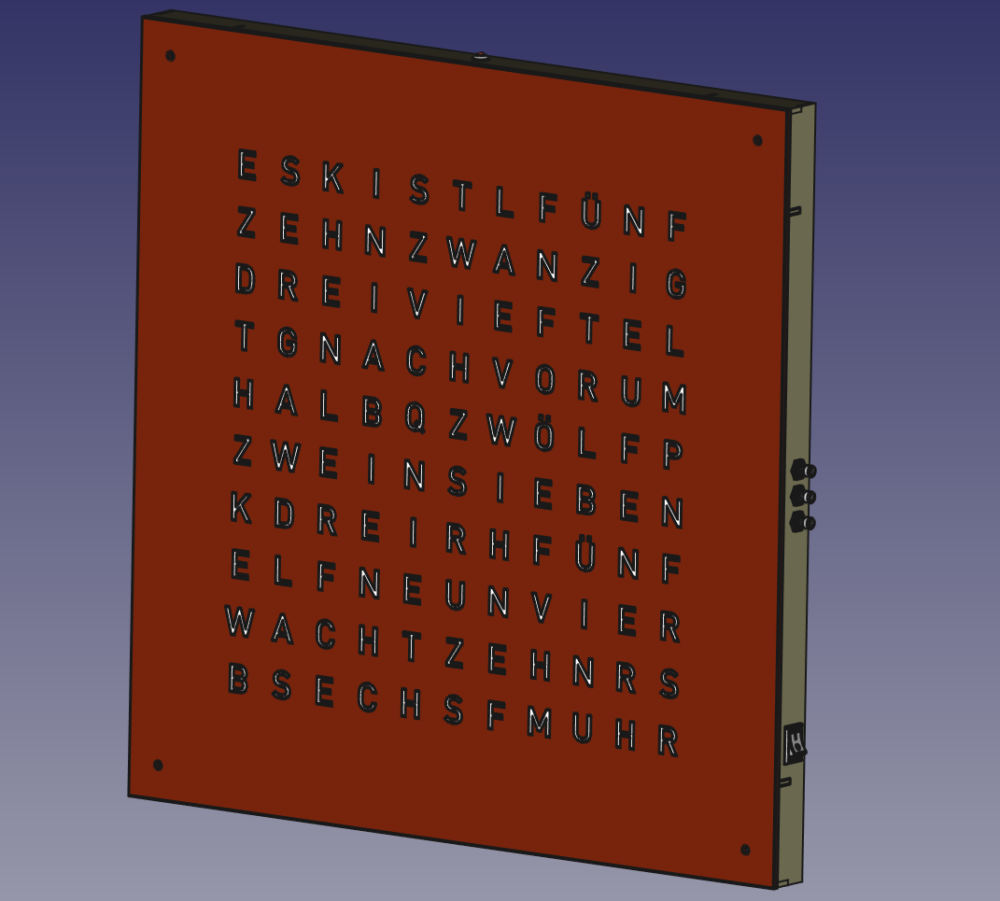

# OpenWordClock
Hardware: 
Source code: 

OpenWordClock. I wanted one. So I build one. And you can too.

  
<figcaption><b>Fig. 1 - CAD model off the wordclock, as drawn up before build. </b></figcaption>

This Clock reads out the current time for you in words. This is achieved by shining LEDs through a mask with cutouts of specific letters, that form the words to display a time.

## Features
Well, it is a clock. So it obviously displays a time. But appart from that, I was able to pack a few more features under the hood. Currently, the clock is capabale of the following:
- Display 12h time
- 102 colors plus white
- Automatic color cycling
- Brightness setting
- Temperature display

In addition, I have ideas and concepts for mrore features.
#### in development
- Dynamic brighness (based on room brightness)
- Nightmode (display off at night)
- Seconds display

#### planned
- Language support (at compile time)

## Technical overview
From a technical standpoint, this project can be divided roughly in four parts: body, electronics, source code, and the face plate.

#### Body 
The body is a grid of slotted MDF parts completed by a suiting backplane and an outer frame. All is held in place by 3D-printed custom fixtures and a bit of glue here and there. All body components are laser cut from a single 600 mm x 900 mm sheet of 3 mm MDF. The templates for laser cutting are located in the cad directory. 

#### Electronics
I use stander WS2812B RGBW LED strips to light each letter. The body components are designed to match the pitch of an LED strip with 30 LEDs per meter. The strips are directly glued to the baseplate. 

The logic board is based around the ATMega328P and in essence a custom Arduino Nano. For the clock, I added a DS3231 real time clock. The electronics are completed by buttons for control and a photodiode for ambient brightness measurements. 

## Contributors
The electrical and mechanical design, C++ and python code, and features have mainly been developped by me, Jacob Nürnberg. Thanks go to various colleages for the numerous discussions on implementation details and support with 3D-printed pards, electrical components and implementation specific questions.

## A note on licensing

I have put quite some effort into this project and would like everyone to be able to build their own wordlock. Nonetheless, this remains a DIY project and at this point, I do not plan to commercialize any of it. If you are not willing to put the efforts and time into building your own personal wordclock, then it is only right to support the original Qlocktwo and support their buisiness by purchasing one of them. 

Therefore the licensing on this project is restricting use for non-commercial purposes for the hardware components. 

Hardware: 

For software on the other hand, I am all in favour of FOSS. The code of this project does not do magic but rather utilises and combines existing tools. So, go ahead and use and adapt it.

Source code: 

