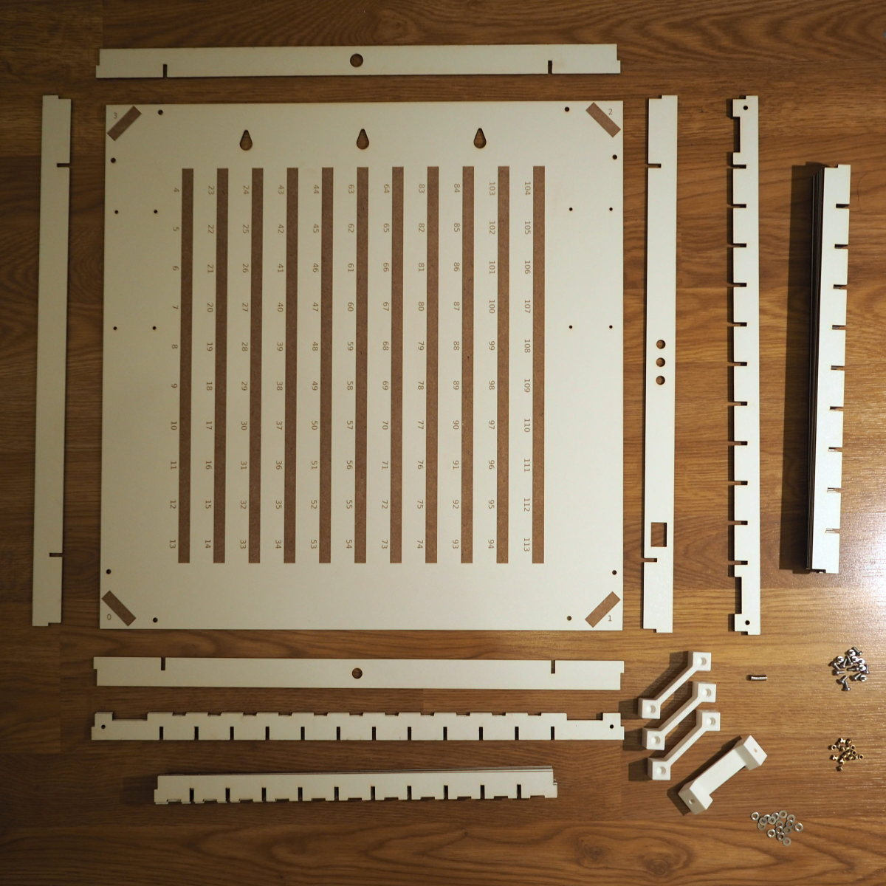

.. _sub-body:

Body
----

The figure below shows all parts and fasteners needed for the assembly of an OpenWordClock. Note, that some of the MDF body components are stacked up upon each other. To identify the individual parts in this picture, please refer to the :ref:`body parts lists <sub-parts>`.

   All body parts and fasteners needed for the assembly of the body of an OpenWordClock.

While of-the-shelf components are used for most part of OpenWordClock, the body is make up of many custom design parts. So before starting with the assembly, the custom parts have to be manufactured. 

Custom parts
~~~~~~~~~~~~

The body consists of custom designed slotted components from 3 mm thick MDF. These components are designed to be laser cut from a single sheet of 900 mm x 600 mm stock material. These measurements are supported by most commercially available laser cutters. As stock material, one can either use uncoated MDF, however using white painted MDF results in a nice internal and external surface finish and can usually be purchased at your local hardware store. Make sure to buy the variant with both sides painted.

For laser cutting, figure out, if you can find a local makerspace of fablab with a suitable laser cutting tool near you. Usually, you can go there and laser cut your stock material yourself in exchange for a small support for the makerspace. Also consult with the local staff, more often than not, they are able and willing to provide valuable support on their tool, such as on cutting parameters and material dependent settings. 

Once cut, clean the components with a little soap water and remove any laser cutting residue or burn marks. Make sure not to soak the components (MFD will swell and deform when in contact with water) and let them properly dry afterwards.

For the 3D-printed corner blocks, you an also consult with your local makerspace. It is rather common to find a 3D-printer there. Another possibility would be a colleague or friend in possession of a printer. Or you may even own one yourself. 

I printed my parts in PLA, however, any other thermoplastic should work as well. Make sure though to use a reformable thermoplastic, as after the print, heat set threaded inserts will be installed to allow for mounting.

Now, that you have all custom parts, it's time to start the assembly of the body.

Assembly
~~~~~~~~

The following step-by-step instructions will guide you through the assembly of an OpenWordClock. 

#. Start out by inserting four threaded M3 head set inserts into the associated holes in the 4 corner blocks.
   
   - **Parts needed**:

     - 4 corner blocks

     - 16 M3 threaded heat set inserts

   - Pay attention to where you install the inserts, as the corner blocks contain 2 additional holes for ambiguity. Refer to the images below for the right position.

   - The heat set inserts are easily installed with the tip of a soldering iron. Reduce the temperature to avoid burning or scorching the 3D print. 

   - Install one magnet in each of the counter sunk holes on the top of the corner blocks with universal or super glue.

   .. list-table::

     * - .. figure:: ../img/openwordclock_body_02.jpg
           :figwidth: 300
           :align: center
           :alt: Corner block with heat set inserts
 
           Corner block with M3 threaded heat set inserts before assemlby.
 
       - .. figure:: ../img/openwordclock_body_03.jpg
           :figwidth: 300
           :align: center
           :alt: Corner block with installed heat set inserts

           Corner block readily assembled with heat set inserts.
   
#. Assemble the grid structure.

   - **Parts needed**:

     - 4 corner blocks with heat set inserts
     - 10 body parts vertical short
     - 9 body parts horizontal short
     - 2 body parts vertical long
     - 2 body parts horizontal long
     - 8 M3 washers
     - 8 M3x6 machine screws

   - Start assembling the grid structure by slotting in the 10 vertical short and 9 horizontal short body parts.

   - Install the vertical long and vertical short body parts along the outside of the assembled grid. 

   - In each corner install a corner block with 2 M3 screws and matching washers through the holes in the vertical long and vertical short body parts. 

     - Pay attention to have the slotted cable feed through on the same side as the feed through cut outs for the LEDs in the horizontal short and long body parts.  

   .. list-table::

     * - .. figure:: ../img/openwordclock_body_04.jpg
           :figwidth: 300
           :align: center
           :alt: Grid structure with corner blocks.

           Grid structure with corner blocks.
 
       - .. figure:: ../img/openwordclock_body_05.jpg
           :figwidth: 300
           :align: center
           :alt: Corner block installed on grid structure.
 
           Corner block installed on grid structure.
  
#. Add the base plate.

   - **Parts needed**:

     - 1 baseplate

     - 8 M3 washers

     - 8 M3x6 machine screws

   - Install the base plate with 8 M3x6 machine screws and matching washers from the back. 

   - Pay attention to having the engraved position marks for the LED stripy running vertically through the grid. 

   .. list-table::

     * - .. figure:: ../img/openwordclock_body_06.jpg
           :figwidth: 300
           :align: center
           :alt: Base plate fixture points.

           Base plate fixture points.
 
       - .. figure:: ../img/openwordclock_body_07.jpg
           :figwidth: 300
           :align: center
           :alt: Corner with base plate in position.
 
           Corner with base plate in position.

#. Add the frame.

   - **Parts needed**:

     - 1 body part top

     - 1 body part right

     - 1 body part bottom

     - 1 body part left

     - Wood glue

   - At this point, you have to decide whether your OpenWordClock shall have the controls on the left or on the right hand side. Depending on your decision, you have to place the body frame part accordingly. Identify where each frame part goes.

     - The top frame part has a small centered hole for the photodiode.

     - The bottom frame part has a larger centered hole for the power supply barrel socket. 

     - The part with 3 holes for buttons and one rectangular cutout for the power switch houses the controls. You decide, whether this is on the left or on the right.

     - The last part has no cutouts and goes either on the left or right, depending on your decision above. 
   - Apply some wood glue and everywhere, where the frame parts come in contact with the grid, but not the base plate. Also apply wood glue in the corners, where the frame pieces touch. 

   - Align, position, and fix in place the frame pieces. Some painters or electrical tape around the corners helps to keep the pieces in place while curing (not yet applied in images).

   .. warning::
     Make sure, that you don't glue the frame to the base plate. You will want to remove the base plate later to install the electronics. 

   .. list-table::

     * - .. figure:: ../img/openwordclock_body_08.jpg
           :figwidth: 300
           :align: center
           :alt: Wood glue applied on corner block.

           Wood glue applied on corner block.
 
       - .. figure:: ../img/openwordclock_body_09.jpg
           :figwidth: 300
           :align: center
           :alt: Frame positioned for curing.
 
           Frame installed and positioned for curing.

#. Apply edge band

   - **Parts needed**:

     - Edge band in color of choice, approx. 2 m

   - Once the glue has cured, apply edge band all the way around the frame. 

     - The cutouts will later be cut free of the edge band again.

     - Word carefully around the corners to prevent ugly breaks in the edge band.

     - Place the start and end of the edge band on one of the upper corners, as they are like less visible when wall mounting the OpenWordClock.

   - With a sharp carpenters knife, cut of excess edge band. 

   - If necessary, sand down the edge band edges for a good finish. 

   .. figure:: ../img/openwordclock_body_10.jpg
     :figwidth: 300
     :align: center
     :alt: Edge band applied before cutting of excess.

     Edge band applied before cutting off excess.

Congratulations, you have successfully assembled the body of the OpenWordClock. When ready, continue with the :ref:`logic board and control electronics <sub-logicboard>`.
