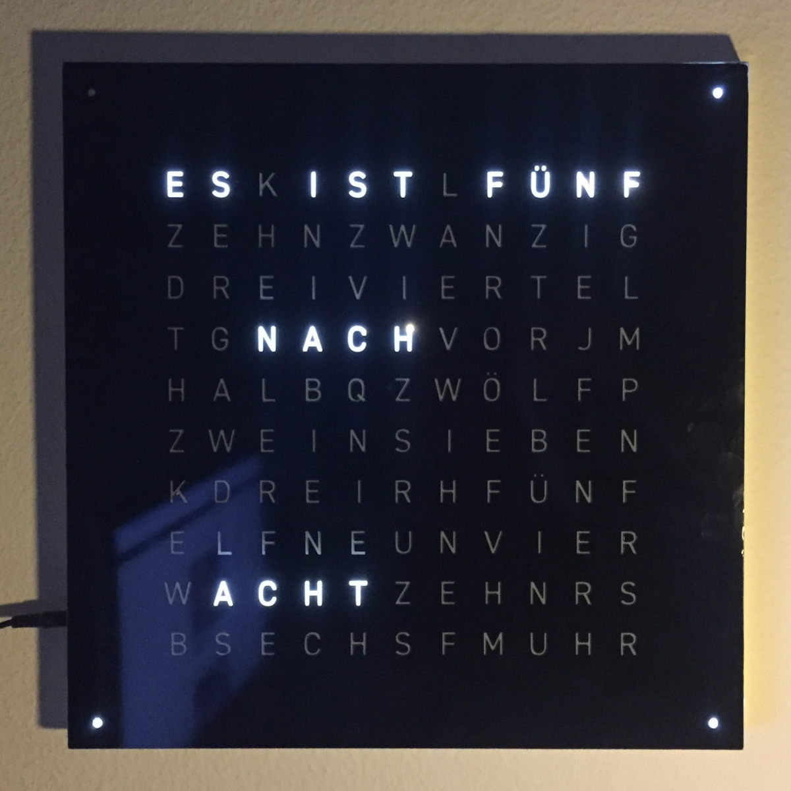

.. _sub-frontpanel:

Front panel
-----------

Finally, it is time to give OpenWordClock its face. Within this project, two different styles of front panel are discussed. However, there are more techniques, that can equally be used to create a suitable front panel.

Diffusor materials
~~~~~~~~~~~~~~~~~~

To get evenly lit letters, either through a foil stencil or through a laser cut front panel, OpenWordClock needs a suitable diffusor. While in the first approach, the diffusor is the front panel carrying material at the same time, only a thin diffusing layer is needed in the second approach. 

Good results can be achieved with milky acrylic sheets. However, I found polystyrene to create an even better and homogeneous distribution of light. In addition, polystyrene is available either as 0.5 mm thick sheets or as 2 mm thick plates, so it can be used for either style of front panel.

The 0.5 mm thick sheets are usually available in an artists supply shop and can be cut to shape with scissors or a sharp knife. Here, no minimum size is required, but for laser cut front panels, the diffusor can consist of multiple pieces. Thicker polystyrene can be sourced in a hardware store, where it is common to order custom sizes as well. For foil front panels, the diffusor should be cut to 450 x 450 mm and be between 2 and 3 mm thick.

Foil on diffusor
~~~~~~~~~~~~~~~~

The first approach consists in applying a foil stencil to a milky screen as front panel. This technique is particularly suited for custom printed front panels and glossy finishes without resorting to paint or lacquer. In contrast to the other approach, the foil on acrylic approach allows for full letters without any bridges or supports.

   Foil on acrylic front panel. 

- Cut the front panel on a large scale foil plotter.

  - Consult your local fablab or makerspace. You may likely find a suitable foil plotter there. You need a plotting width of at least 500 mm. 

  - Some plotters also support printing, so you can print your very personal OpenWordClock design.

- carefully remove all letters from the stencil

  - Suitable tools for this task are a sharp exacto knife, fine tweezers and possibly a needle. 

  - Be careful not to remove the internal parts of letters such as A, D, O, or R.

- Apply transfer foil

  - Ask at your local fablab or makerspace, where you may find a suitable transfer foil. 

  - Make sure to evenly apply pressure to have all parts attached. 

- Remove the protective layer and apply the stencil to the diffusor

  - When removing the protection layer, make sure all internal letter parts stay attached to the transfer foil.

  - When transferring the stencil over to the diffusor, use plenty of soap water, to be able to readjust the position. Then push the water out from the center to the edges to avoid bubbles. 

- Fold over the stencil edges over the diffusor to get clean edges.

- Finally, remove the transfer foil. To see how to attach the magnets, keep reading at the bottom of this page. 

Laser cut front panel
~~~~~~~~~~~~~~~~~~~~~

This second approach of a front panel is very suitable for front panels of wood, metal or other materials with a particular surface finish. The images below show a front panel from 3 mm teak plywood.

.. list-table::

  * - .. figure:: ../img/openwordclock_frontpanel_02.jpg
        :figwidth: 300
        :align: center
        :alt: Diffusor on the back side of a front panel.

        Diffusor on the back side of a front panel.

    - .. figure:: ../img/openwordclock_frontpanel_03.jpg
        :figwidth: 300
        :align: center
        :alt: Final assembled front panel. 

        Final assembled front panel. 

- Take your stock material to your nearest cutting laser and cut out the stencil.

  - Make sure to choose the template with the bridges in letters like A, B, O, or R to avoid ugly holes. 

- Take your diffusor, measure and cut it into correctly sized pieces. 

- Glue the diffusor behind the letters, either with doubly sided tape or a universal purpose glue. 

That's it, done. For installing the mounting magnets, keep on reading below. 

Attaching magnets for mounting
~~~~~~~~~~~~~~~~~~~~~~~~~~~~~~

As a final step, it is time to install the mounting magnets on the front panel. There is a rather simple but powerful trick to achieve a good result.

- Take out the readily assembled body of your OpenwordClock and apply a strip of plastic wrap across the corner blocks with the countersunk magnets. 

- Take the magnets for the front panel and place them on the magnets in the corner blocks. The align perfectly on their own

  - If the countersink in the corner block is slightly too deep, place an additional magnet below the plastic wrap to raise the magnet for the front panel. You can remove it later.

- Apply universal glue to all magnets.

- Place and carefully align the front panel on top. Wait until the glue has cured.

- Remove the plastic wrap and eventual additionally placed magnets. Reinstall the front panel.

Congratulations. Your OpenWordClock is now fully assembled. 
