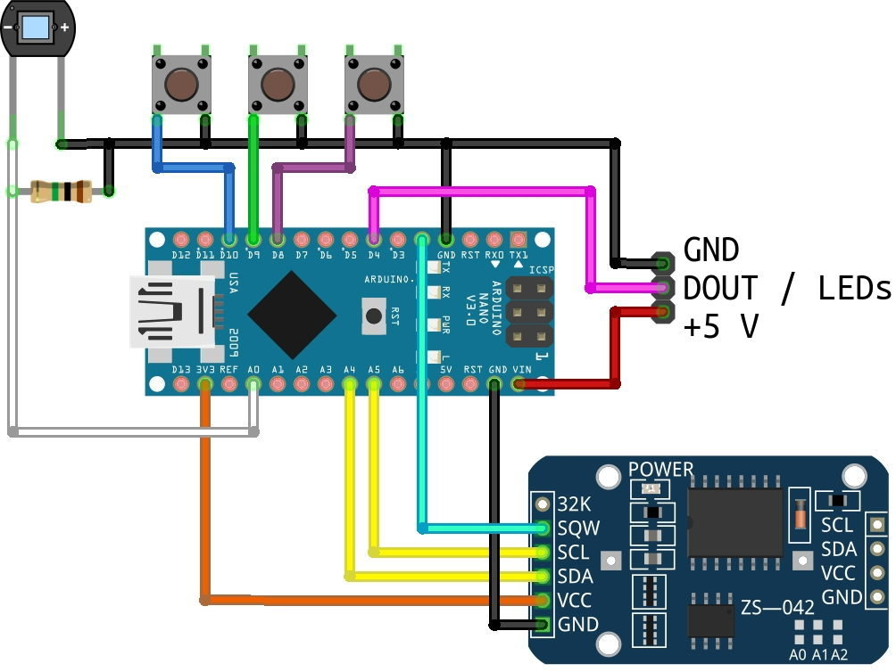
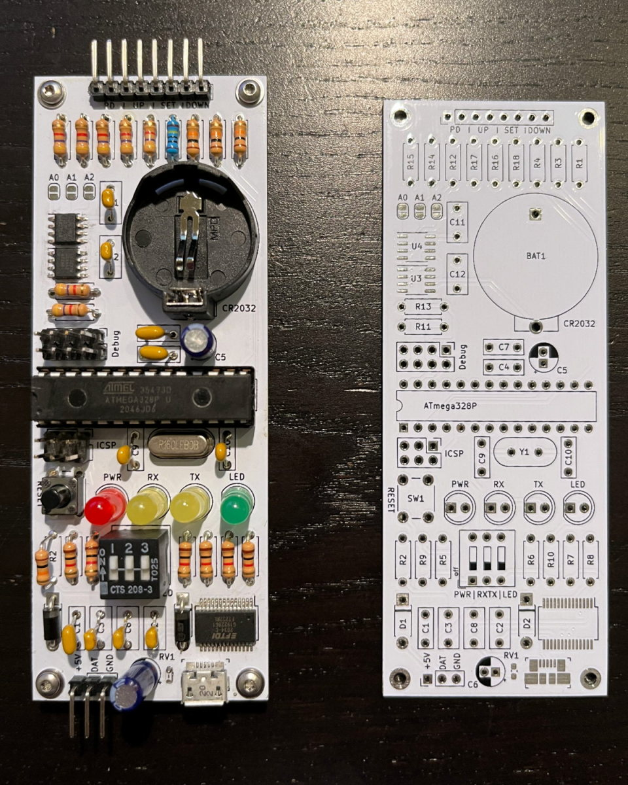

.. _sub-logicboard:

Logic board
-----------

Generally, there are two approaches to setting up the microcontroller and clock unit inside the clock. 

The first option consists in pairing an Arduino Nano with a DS3231 RTC module. Connections are realized with simple jumper wires, alleviating the need to solder a lot of connections. However, this approach adds a few wires to the assembly and there is no dedicated mounting point inside the OpenWordClock to mount Arduino and RTC.

To reduce wire cluttering and cleaning up the internals, I have designed a custom circuit board, that combines Arduino and RTC module on a single PCB. The PCB features dedicated connectors for buttons, LEDs etc.

Option 1: Arduino and RTC
~~~~~~~~~~~~~~~~~~~~~~~~~

For this approach, there is no need to solder any components to a PCB and additionally, the components can be acquired as off-the-shelf evaluation boards: All needed are an Arduino Nano and a DS3231 evaluation board. In fact, the entire hardware and source code development was done on such a setup. The image below depicts the necessary connections.

   
   Evaluation board approach with all connections needed for the OpenWordClock. The connector on the left hand side is indicating the connections for power supply and data communication towards the LEDs.

.. note::
   If feasible, you may also use a breadboard for the assembly. However, it is not guaranteed, that the breadboard will fit into the OpenWordClock.

- Connect the clock module to the Arduno Nano

  - Connect the VCC pin to the 3.3 V pin on the Arduino Nano

  - Connect the GND pin to any Arduino Nano GND pin

  - Connect the SDA and SCL lines to the SDA (pin A4) and SCL (pin A5) pins on the Arduino

  - Finally, connect the SQW pin to pin 2 (D2) on the Arduino to receive interrupts of the RTC.

- Prepare the photodiode with a 1 MOhm resistor between the leads. Make sure to also attach wires to both leads and leave enough spare for later connections.
  
For now, that's it. Check the image above for all other connections, that have to be made later on. 

Option 2: Custom PCB
~~~~~~~~~~~~~~~~~~~~

To remove wire clutter and integrate all electronics on one logic board, I designed a custom PCB, that combines the Aruino and the RTC module. In essence, it is still a simple Arduino Nano with the RTC module on the same PCB and matching connections for the OpenWordClock. The image below shows the PCB in raw and assembled state. 

   Custom OpenWordClock PCB in assembled and raw state.

After acquiring the PCBs from your preferred PCB manufacturer, populate it according to the list, that can be found on the repository. While most of the components are through-hole (THT) components, I couldn't find suitable THT versions of some. These remaining components are SMD components. There are several different techniques to solder SMD components with a common one being a hot air soldering iron. 

Once fully assembled, the logic board has all components and connectors, that are needed for the OpenWordClock. 
