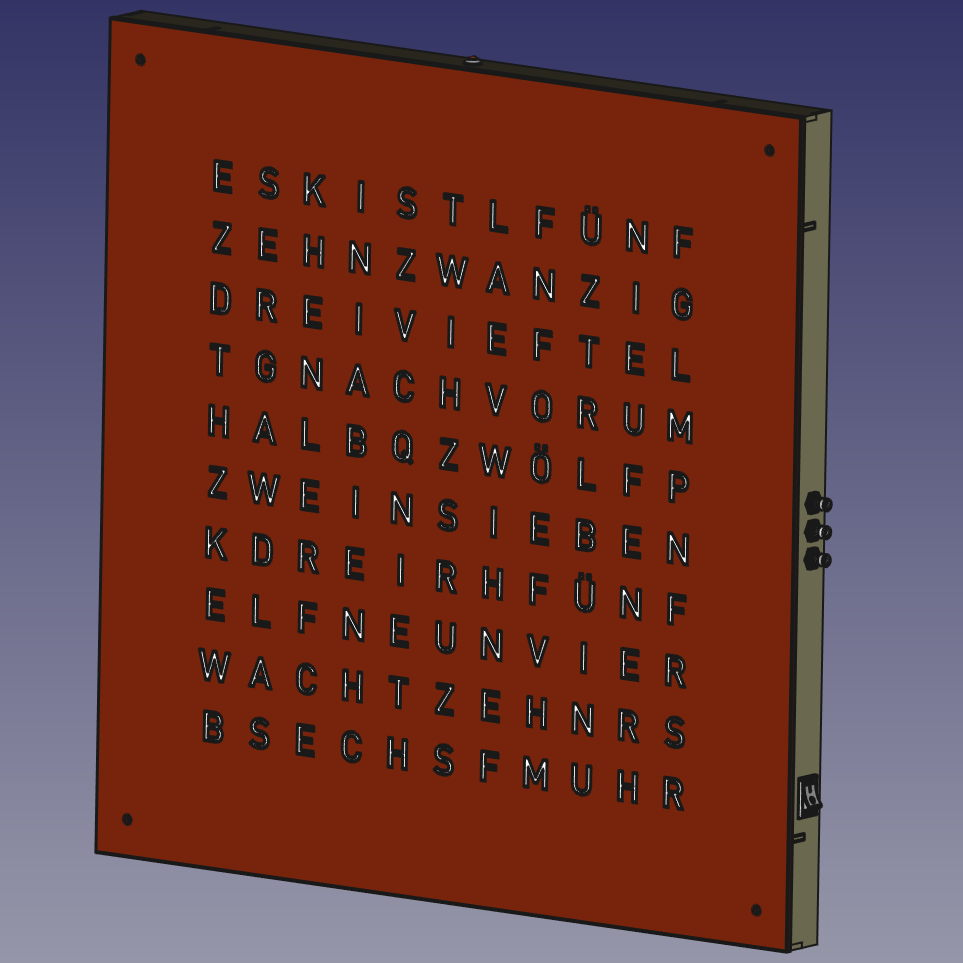
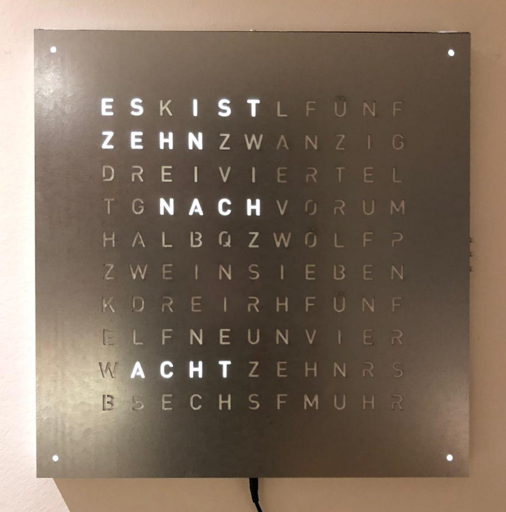

.. OpenWordClock documentation master file, created by
   sphinx-quickstart on Tue Oct  4 23:29:39 2022.
   You can adapt this file completely to your liking, but it should at least
   contain the root `toctree` directive.

.. meta::
   :description: OpenWordClock is a fully open source DIY arduino based word clock for hobbyists. It is designed to be realisable with access to a local makerspace and simple tools. 
   :keywords: wordclock, arduino, diy, opensource, makerspace, fablab
   :keywords lang=en: project, do it yourself
   :keywords lang=de: wortuhr, projekt, selber bauen

.. _sec-openwordclock:

OpenWordClock
=============

OpenWordClock is a fully open source wordclock that can be realised with hobbyist tools and capabilities.

The project repository is hosted on `GitLab <https://gitlab.com/JacobNuernberg/openwordclock>`_.

+-------+-------+
| |cad| | |img| |
+-------+-------+

I always fancied owning an official `Qlocktwo <https://qlocktwo.com/>`_, however found them to be rather expensive. On the other hand I was fascinated by the idea to realize one as my own project. When I then came to know about a makerspace near me with the capabilities of laser cutting and 3D-printing, I set out to realize my idea. 

My aim throughout this project was to design it in such a way, that any hobbyist with a basic skill set and the will to learn new things could realize this project. The body work is laser cut or 3D-printed, the electronics are off the shelf components and the source code is build in the `Arduino <https://www.arduino.cc/>`_ environment. 

Contents
========
.. toctree::
   :maxdepth: 2

   overview
   manual
   hardware
   software
