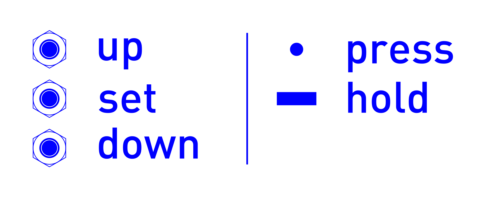
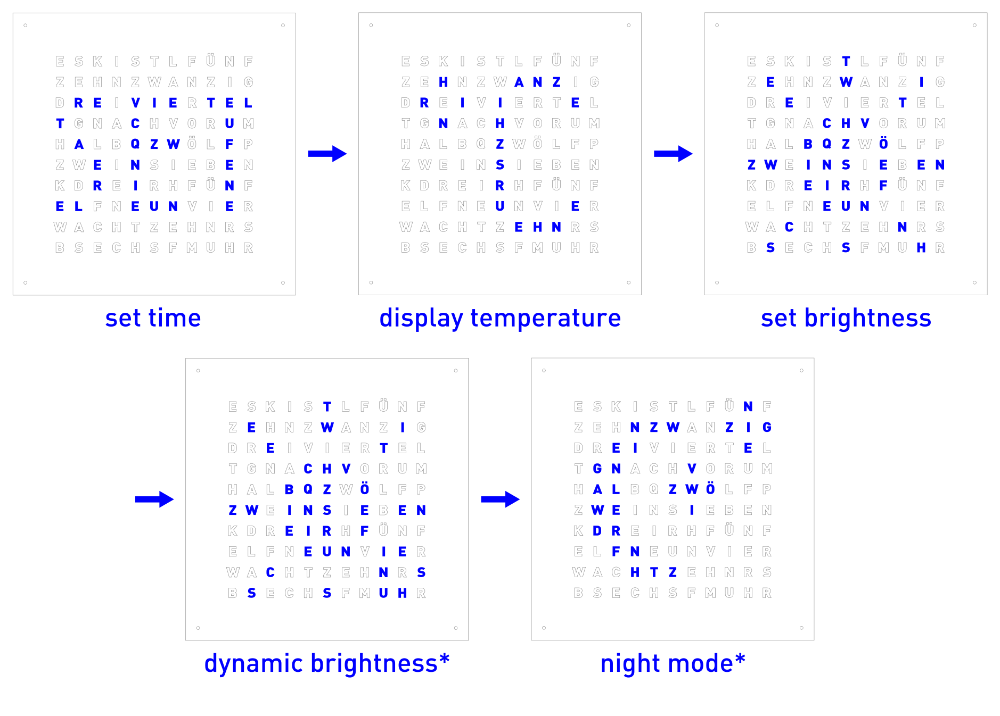

Operating manual
================

..
   Some custom directives, that I will use in the manual.
.. |press|  unicode:: U+25CF .. MORSE SHORT
.. |hold|  unicode:: U+25AC .. MORSE LONG

Please be aware, that this is a DIY project. The controls may vary in your implementation. In addition, the whole project is work in progress and the implementations may change while this operating manual is not yet fully up to date.

Controls 
--------
Depending on the assembly of the clock, the controls are either on the left or the right side of the clock. The controls consist of a power switch and 3 simple push buttons.

Power 
~~~~~
The clock operates on 5 V power supplied though a standard 5.5 mm / 2.5 mm barrel jack at the bottom of the chassis. In normal operation, the clock pulls between 0.5 A and 2 A of current, depending on the selected brightness. I recommend using a power supply, that can supply at least 3 A of current at 5 V. 

In addition, the clock has a power switch, that acts directly on the 5 V supply line. Switching the clock of with this switch removes power from all components, including the logic board. Therefore, all settings set by the user (e.g. color, color mode, brightness etc.) are lost, when turning off the clock. Only the time is kept due to a standby battery cell on the logic board for the real time clock module.

Buttons
~~~~~~~

The clock features three buttons on one side. In this manual, the buttons are referred to as as up, set, and down, as depicted in the image above. All buttons support two different actions, press and hold, where a hold has to last at least one second. The notation chosen in this manual is shown on the right with |press| for press and |hold| for hold.  

Changing the color
------------------

When not in the menu and the clock is displaying the time, the buttons control the color of the display. The clock has three color modes and starts up with a static color. 

- Pressing |press| **set** cycles through the color modes.

  - Pressing |press| **set** once changes the color to constant white.

  - Pressing |press| **set** again activates color cycling mode. The display blinks once. Every time the display updates, the color is slowly advanced along the rainbow. 

  - Pressing |press| **set** again returns to constant color mode and the display will be one fix color. 

- Pressing |press| **up** or |press| **down** returns the clock to constant color mode (if not already) and advances the color one step along the rainbow. 

- Holding |hold| **up** or |hold| **down** returns the clock to constant color mode and starts cycling through all colors. Release the button at the desired color.

Menu
----

- To enter the menu, hold |hold| **set**. The display changes to image mode and displays the first menu item.

- Press |press| **up** or |press| **down** to navigate through the menu items.

- Press |press| **set** to enter the according menu item

- The image below shows the five different menu items. These are

  - Set the time

  - Display the current temperature

  - Change the display brightness

  - Dynamic display brightness (experimental)

  - Configure night mode (experimental, unstable)

Setting the time 
~~~~~~~~~~~~~~~~

Navigate to the correct menu item and confirm with |press| **set**. When setting the time, pressing |press| **up** or |press| **down** changes the current value and pressing |press| **set** confirms the selection. 

- The hour is blinking. Select the current hour with |press| **up** or |press| **down** and confirm with |press| **set**.

- The 5 minute indicator is blinking. Select the recently passed 5 minute mark with |press| **up** or |press| **down** and confirm with |press| **set**.

- The minute indicators in the corners are blinking. Press |press| **up** or |press| **down** to light up as many corners as necessary to complete the current minute. Confirm with |press| **set**.

- The clock switches to image mode and displays either AM or PM. Select either with  with |press| **up** or |press| **down** and confirm with |press| **set**.

- Still in image mode, the clock displays the current second. Reset the second to zero with  with |press| **up** or |press| **down** and confirm with |press| **set**.

When completing the last step, the current time will be set.

Display temperature
~~~~~~~~~~~~~~~~~~~

Navigate to the correct menu item and confirm with |press| **set**. The clock switches to image mode and displays the current temperature for the next minute. Press |press| **set** to return to the time display earlier.

Changing the brightness
~~~~~~~~~~~~~~~~~~~~~~~
Navigate to the correct menu item and confirm with |press| **set**. The clock switches back to display the time. Press or hold |press|/|hold| **up** or |press|/|hold| **down** to adjust the display brightness.  Confirm with |press| **set**.

Dynamic brightness
~~~~~~~~~~~~~~~~~~

.. note::
   This is an experimental feature. Once functionality is fully established, the manual for this feature will be added.
   
.. 
   Navigate to the correct menu item and confirm with |press| **set**.

***Work in progress.***

Night mode
~~~~~~~~~~

.. note::
   This is an experimental feature. Once functionality is fully established, the manual for this feature will be added.
   
.. 
   Navigate to the correct menu item and confirm with |press| **set**.

***Work in progress.***

Maintenance
-----------

Changing the battery
~~~~~~~~~~~~~~~~~~~~

To keep track of the current time, even when powered of, the real time clock module has a standby battery. When removing the front panel, the battery can easily be located on the logic board. Should the battery run empty, replace it with any suitable CS2032 battery.

Board reset 
~~~~~~~~~~~

Should it be necessary to reset the logic board on the clock, i.e. because an error occurred during operation, one can either switch power off, wait a few seconds, and turn it back on. Alternatively, the logic board has a reset switch on its left side to reset the program, without power cycling. Press and hold the reset button for 5 seconds. When released, the clock starts up normally. 

Internal status LEDs
~~~~~~~~~~~~~~~~~~~~

The logic board has 4 status LEDs soldered directly to it, that can be turned on or of with three DIP switches directly on the logic board. Depending on your choice of front panel, it is advised to turn the status LEDs of in normal operation to prevent them from shining through a not fully opaque front panel. 
