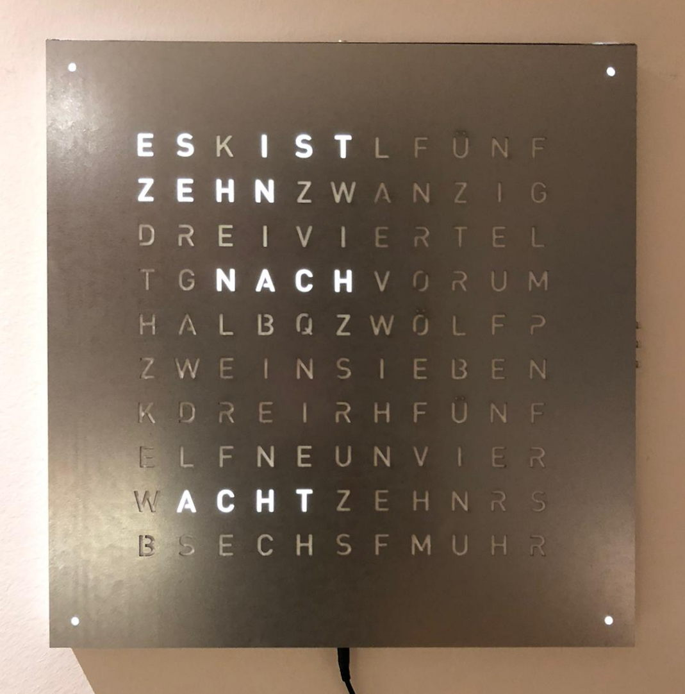

.. _sec-overview:

Overview
========

The concept of a wordclock is widely known, and I think it does not need further introduction: It reads the time to you. 

I am also not the first person to turn this clock into a DIY project. A quick web search for the terms "DIY" and "wordclock" yields plenty or results. My realisation is also not the most advanced. Nor the simplest. Or even the fastest to realize. So why did I construct my own, instead of using one of the plenty models around the interwebs?

Well, first of all, I like to tinker and fancied the idea to do it all on my own. I wanted to start on a clean slate. Had I known how much time one can spend when starting with a clean canvas, I'd probably better have chosen an existing realization. 

Let me briefly describe my design paradigms before digging into the construction and how this clock works. If you are still following then, I will point you to further material in case you wish to realize your own OpenWordClock. 

Design paradigms
----------------
From the very start of this project, I tried to follow a few but significant design paradigms for everything related to this project. In no particular order, these are. 

1. OpenWordClock should as closely as possible resemble the appearance of the original `Qlocktwo <https://qlocktwo.com/>`_.

2. All parts of the project must be realizable as a hobbyist with access to a public makerspace or similar. 

3. OpenWordClock was always intended to be published free and open source. 

Of course, I had to adapt the face of OpenWordClock to match commercially available components. Also, the choice of microcontroller limits the number of features to a subset of the original. 

To be able to realize all this as a hobbyist, I resorted to using free and open source software, whenever possible. The 3D models and technical drawings are realized in `FreeCAD <https://www.freecad.org/>`_, further sketches are done with `Inkscape <https://inkscape.org/>`_. To design the logic board, I used `KiCAD <https://www.kicad.org/>`_ and for source code development I used the `Arduino IDE <https://www.arduino.cc/en/software>`_ and its libraries. 

For the actual build, I consulted my local makerspace at the `Dynamo <https://www.dynamo.ch/>`_ in Zurich, where I had access to laser cutting, 3D-printing and foil plotting equipment.

Finally, published as a free an open source project, everybody is invited to realize their own OpenWordClock. And of course everybody is invited to adapt it to their personal needs.

Construction
------------

.. figure:: ./img/openwordclock_02.jpg
   :figwidth: 70 %
   :align: center
   :alt: Image of the construction of OpenWordClock

   Internal construction of OpenWordClock. The slotted structure of the separator grid and the corner blocks are clearly visible. 

The body is constructed from slotted MDF parts and a matching baseplate. All is held in place with screws and some glue on 4 corner blocks with heat set threaded inserts. For a nice outer finish, the frame is wrapped with edging strips.

The outer measurement with 450 mm x 450 mm match the measurements of the original. The body is 25 mm deep (22 mm internally). The slotted structure forms a separator grid matching the pitch of commercially available LED strips with 30 LEDs per meter. The result is a square 330 mm x 330 mm grid with 11 columns of 10 LEDs. Each column contains a strip with 10 LEDs with one more LED in every corner.

The baseplate holds all electronics, apart from controls, that are placed in the outer frame. The 3 control buttons and the power switch can be either placed on the left or on the right. Similarly, the logic board can be mounted on the left or on the right. The 5.5 mm / 2.5 mm barrel jack for power is always on the bottom. A photodiode for room brightness detection is placed in the top. 

   OpenWordClock with laser cut zinc steel front panel. A polystyrene diffusor evens the illumination of the letters.

I tested two different styles of front panels: laser cut stencils or foil masks on diffusor plates. Both styles yield excellent results and are suitable for different finishes. 

The laser cut stencil approach is best for wood or metal front panels, where one would like to preserve the surface structure of the original material. The letters are cut from the material stock, then a diffusor is applied behind all cutouts. 

The foil approach uses a foil as mask, that has the advantage, that it can be custom printed unlike complex material surfaces. After printing and cutting on a foil plotter, the cutout letters are removed and the foil is transferred to an acrylic or polystyrene sheet with transfer foil. 

In either case, the front panel is held on the clock with 8 magnets with matching counterparts in the corner blocks. The magnets in the corner blocks are countersunk to yield a tight fit and prevent sliding of the front panel. 

How does it work?
-----------------

Well, in essence, it's all really simple, right? RIGHT?!?

Basically, you take the time and light up the correct LEDs behind the right letters to spell out the time. But wait, there is actually a fair bit of logic running in the background. 

First thing needed is a clock and while the common watch is nice and handy, it's not very suitable for such project. OpenWordClock uses a `DS3231 RTC module <https://www.analog.com/en/products/ds3231.html>`_ from Analog Devices to keep track of the time. Every minute, the RTC uses an interrupt to signal to the microcontroller that another minute has passed. 

The microcontroller, an `ATmega328P <https://en.wikipedia.org/wiki/ATmega328>`_ like on an Arduino, reads out the current time and translates it to a series of indices, that correspond to the LEDs behind the right letters to light up. It then sends out a digital signal to the individually addressable WS2812B RGBW LEDs. This signal also carries color information for every LED.

Now in addition, to be able to set the time, the microcontroller also has to process inputs from connected buttons. Also for these user inputs, OpenWordClock uses interrupt based routines. 

To combine these seemingly easy tasks, the source code employs a finite state machine. The state machine manages the interrupts and redirects the program flow to the right state to finally display the desired result. And using an interrupt based scheme allows for another advantage: Instead of constantly having to pull for updates, like a new time or a button press (keyword: busy waiting), the microcontroller simply has to wait for the next interrupt. This also allows OpenWordClock to put the microcontroller to sleep whenever no action is needed.

In general, the whole control logic can be put together with off-the-shelf components on a breadboard. A simple `Arduino Nano <https://store.arduino.cc/products/arduino-nano>`_ paired with a `DS3231 eval board <https://www.adafruit.com/product/3013>`_ connected to a few buttons and some LEDs and the electronics are up and running. In fact, this is how my first OpenWordClock was set up. For cleanliness and the sake of learning about PCB design, I created a fully integrated control board, essentially a custom Arduino Nano with a DS3231. This control board resolves a whole rats nest of wires and is neatly mounted inside the word clock.

Where to start?
---------------

Now, that you know the basic principles of OpenWordClock, it is up to you where to continue. 

Did this introduction catch your interest and you want to build a OpenWordClock yourself? Keep reading about the :ref:`hardware and the assembly <sec-hardware>`. Find out, where you can source the components, where you can laser cut and 3D-print, and if you have the tools and the time. Still interested? Then go ahead, what's stopping you. 

Are you interested in the Software that OpenWordClock employs or want to upload and test it yourself? Then read through the :ref:`source code documentation <sec-software>`. 

Or are you already done with your build and need to know how to operate the clock? There is also an :ref:`operating manual <sec-manual>` for OpenWordClock.

In any case, I suggest you check out the `project repository hosted on GitLab <https://gitlab.com/JacobNuernberg/openwordclock>`_ where all resources are hosted. Feel free to leave remarks and report issues. 
